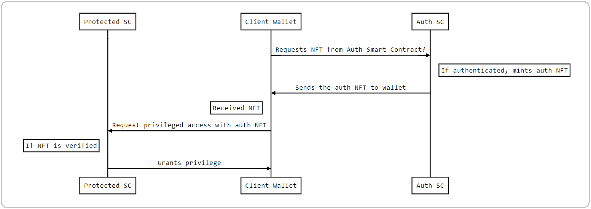

# OAuth-NFT project
OAuth 2.0 type authentication using NFT

This repo includes 
 - documentation in this README
 - smart contracts code with relevant endpoints
 - configuration for building PAB executable
 - A `run.sh` script using which you can run a demo of the functionality in the PAB simulator 

### Idea of OAuth-NFT

This project showcases the potential use of NFT, for implementing OAuth 2.0 type authentication.

The OAuth 2.0 authorization framework enables a third-party application to obtain limited access to an HTTP service, either on behalf of a resource owner by orchestrating an approval interaction between the resource owner and the HTTP service, or by allowing the third-party application to obtain access on its own behalf.

For example, you would have used your social media accounts like Google, Facebook or Twitter to sign up and login to other websites. Behind scenes OAuth 2.0 enables the social login. Further details about OAuth 2.0 be found [here](https://oauth.net/2/)

Potentially NFTs can be used for achieving the functionality of the OAuth protocol used for authentication in web applications. For example, the way you log in to a website using your Google or Facebook account.


### Implementation
In this scheme, there is an issuer smart contract called `AuthNFTIssuer.hs` that mints and issues NFTs to authorised clients. The NFT minted is delivered to the authorised wallet. There is another smart contract called `ProtectedResource.hs` that acts as the custodian of the restricted resource. The protected smart contract grants access to a client wallet if it holds the authentication NFT. If it does not, then access is denied.

What makes the scheme secure is the way the NFT in minted. The NFT's currency symbol in the pkh of the Issuer whereas the token name is the pkh of the client wallet. This makes the NFT policy unique to the issuer as well as the client wallet. The protected smart contract checks wallets by walletId of the issuer as well as that wallet itelf. So a given wallet should have the NFT issued by the issuer and also the token should match its own pkh to be granted access by the protected smart contract.

**Illustration**:
Refer to the diagram below. The client wallet is the one that requests for an authentication NFT. The Auth SC is the smart contract that mints the auth NFT and delivers to the requested client. Whether to authorise a client is decided by issuer and in practice can depend on various aspects.  If authorised, the issuer delivers the NFT to the client. The client can then request access ro the protected resource. The smart contract at the protected resource checks for the correct NFT and accordingly grants or denies access.



This project gives uses the [Plutus Platform starter project](https://github.com/input-output-hk/plutus-starter) as the template.

### Setting up
Please refer to [Setting up](https://github.com/input-output-hk/plutus-starter#setting-up) section of the plutus starter project.

### The Plutus Application Backend (PAB)

With the PAB we can serve and interact with contracts over a web API. You can read more about the PAB here: [PAB Architecture](https://github.com/input-output-hk/plutus/blob/master/plutus-pab/ARCHITECTURE.adoc).

Here, the PAB is configured with two contracts, `AuthNFTIssuer` and  `ProtectedResource` contracts under `/src` folder.

Here's an example of running and interacting with this contract via the API. For this it will help if you have `jq` installed.

1. Build the PAB executable:

```
cabal build plutus-starter-pab
```

2. Run the PAB binary:

```
cabal exec -- plutus-starter-pab
````

This will then start up the server on port 9080. The devcontainer process will then automatically expose this port so that you can connect to it from any terminal (it doesn't have to be a terminal running in the devcontainer).


### How to run the demo

- Perform the setup for **Plutus** as described in the plutus starter project.
- Clone this repo to your local environment.
- Start a nix shell from the plutus repo from the first step.  
- Build the PAB executable:
```
cabal build plutus-starter-pab
```
Ignore the unused import warnings. Did not get time to clean that up.

- Run the PAB binary:

```
cabal exec -- plutus-starter-pab
````
- Now, execute `run.sh` for the demo.
  - You might need to do `chmod +x run.sh` first in case execute permissions are missing.

Finally, also node that the PAB also exposes a websocket, which you can read about in
the general [PAB Architecture documentation](https://github.com/input-output-hk/plutus/blob/master/plutus-pab/ARCHITECTURE.adoc).

#### Endpoints
`AuthNFTIssuer.hs` has the following endpoints:
- `mint` : It mints NFT for a given Wallet id as input and sends it to that wallet.
- `inspect` : It logs the total value in the Issuer. This is used for demoing that the minted NFT is delivered to the client wallet and not kept in the issuer wallet.
- `logWalletNftTokenName` : This logs the token name that the issuer will use for a given wallet id. 

`ProtectedResource.hs` has the following endpoints:
- `checkAccess` : This checks for the correct auth NFT at the given wallet id. If the wallet holds the NFT, access can be granted.

### What you see in the demo
The `run.sh` script execute the following.

- It create 4 wallets. One is the auth NFT issuer, two are client wallets and the last one is the protected resource.
- It then activates the requisite contacts in the wallets. The NFT issuer and 2 client wallets get instance of  `AuthNFTIssuerContract` where the fourth wallet gets an instance of `ProtectedResourceContract`.
- First client Wallet _One_ requests for NFT. The issuer authorises  wallet One. So, it mints an NFT using its own pkh and the Wallet One's pkh. We omit the logic for who to authorise at this point. The client wallets pkh is derived from the wallet id that is passed in the request payload.

- The `inspect` endpoints logs the value in issuer and client wallet. it should show that the NFT was delivered to the client.
- Second wallet, Wallet Two does not obtain the auth NFT.
- Now Protected Resource has to decide who to authorise, Wallet One or Two
- The protected smart contract checks both wallets. It finds the NFT in Wallet One and not in Wallet Two. In the logs, you can see that the protected smarts logs `ACCESS GRANTED` and `ACCESS DENIED` accordingly.


#### Future work
The token name used in this demo was built using the public key hash of the client wallet (NFT requestor). The token name can be encoded with more information like the expiry time of the auth NFT, the list of privileges obtained by holding this NFT etc.  

The contract code can be cleaned up a bit. Did not get time to tidy up some unused imports.

### Tips
#### To use entr to watch your source file during development
```ls src/<file name>.hs | entr -r cabal build plutus-starter-pab --dependencies-only --disable-documentation```

#### Support/Issues/Community

If you're looking for support, or would simply like to report a bug, feature
request, etc. please do so over on the main [plutus repository](https://github.com/input-output-hk/plutus).


Thanks!
